Exploratory Analysis of College Major and Income Data
================
Gaurav Sharma
10/07/2020

``` r
tt_file <- tidytuesdayR::tt_load("2018-10-16")
```

    ## --- Compiling #TidyTuesday Information for 2018-10-16 ----

    ## --- There is 1 file available ---

    ## --- Starting Download ---

    ## 
    ##  Downloading file 1 of 1: `recent-grads.csv`

    ## --- Download complete ---

``` r
recent_grads <- tt_file$`recent-grads`

major_processed  <- recent_grads %>% 
    arrange(desc(Median)) %>% 
    mutate(Major = str_to_title(Major),
           Major = fct_reorder(Major, Median))
```

### What is the median salary for major graduates in the country

``` r
recent_grads %>% 
    ggplot(aes(Median)) +
    geom_histogram()
```

    ## `stat_bin()` using `bins = 30`. Pick better value with `binwidth`.

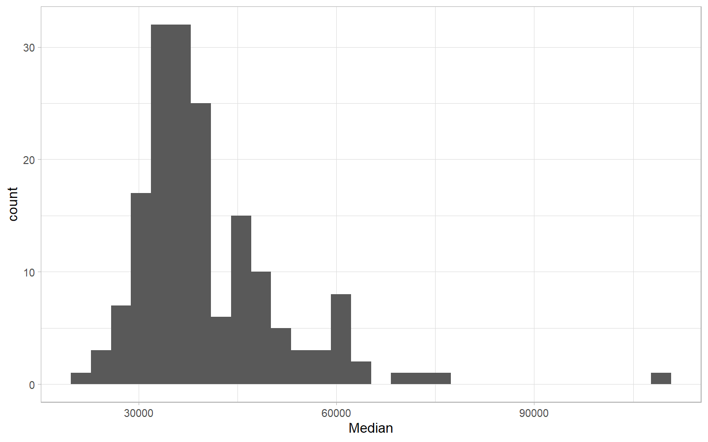<!-- -->

### What categories of major make more money

``` r
recent_grads %>% 
    mutate(Major_category = fct_reorder(Major_category, Median)) %>% 
    ggplot(aes(Median, Major_category)) +
    geom_boxplot() +
    scale_x_continuous(labels = dollar_format())
```

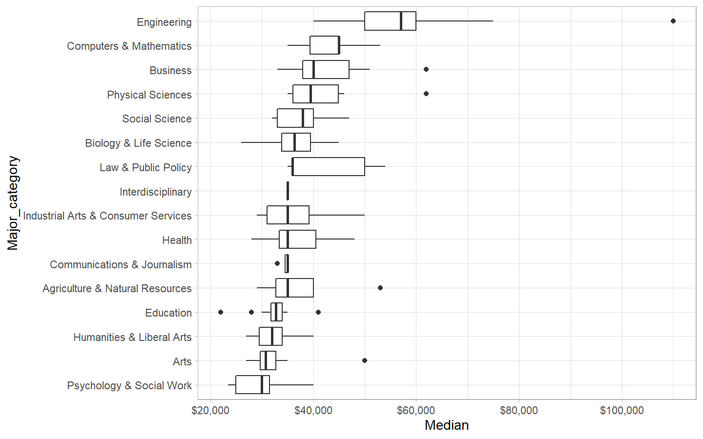<!-- -->

### What categories of major make more money (Median Salary)

``` r
recent_grads %>% 
    group_by(Major_category) %>% 
    summarise(Median = median(Median)) %>% 
    mutate(Major_category = fct_reorder(Major_category, Median)) %>% 
    ggplot(aes(Median, Major_category)) +
    geom_col() +
    scale_x_continuous(labels = dollar_format())
```

    ## `summarise()` ungrouping output (override with `.groups` argument)

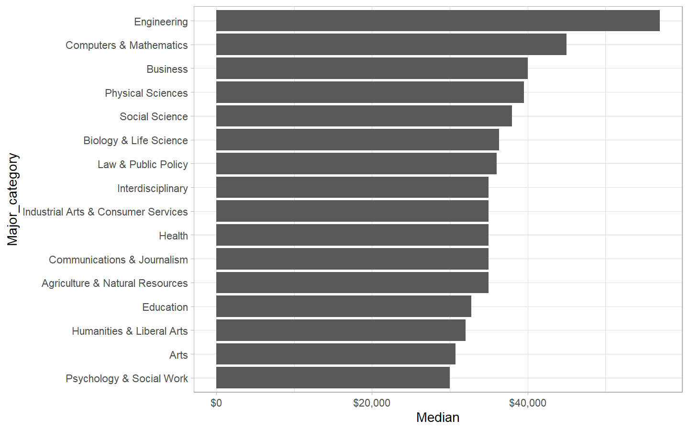<!-- -->

### Which are the highest earning majors

``` r
recent_grads %>% 
    arrange(desc(Median)) %>% 
    select(Major, Major_category, Median, P25th, P75th, Sample_size) %>%
    filter(Sample_size >= 100) %>% 
    head(20) %>% 
    mutate(Major = str_to_title(Major),
           Major = fct_reorder(Major, Median)) %>% 
    ggplot(aes(Major, Median, color = Major_category)) +
    geom_point() +
    geom_errorbar(aes(ymin = P25th, ymax = P75th)) +
    coord_flip() +
    scale_y_continuous(labels = dollar_format()) +
    expand_limits(y = 0) +
    labs(title = "Which are the highest earning majors",
         subtitle = "Chosen from the majors where atleast 100 graduates were surveyed. Bars represent IQR",
         x = "",
         y = "Median Salary of Graduates")
```

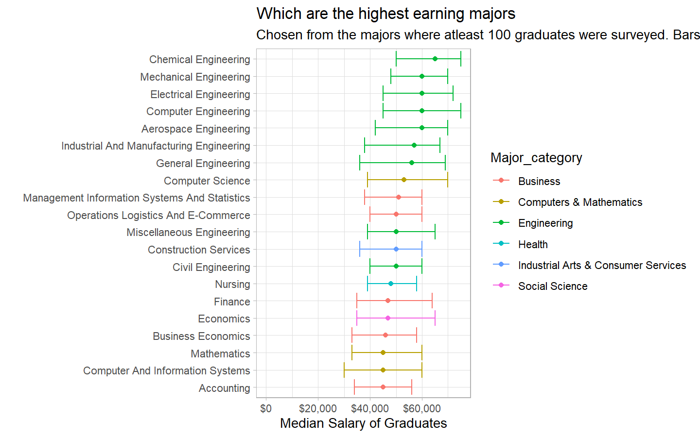<!-- -->

### Which are the lowest earning majors

``` r
recent_grads %>% 
    arrange(desc(Median)) %>% 
    select(Major, Major_category, Median, P25th, P75th, Sample_size) %>%
    filter(Sample_size >= 100) %>% 
    tail(20) %>% 
    mutate(Major = str_to_title(Major),
           Major = fct_reorder(Major, Median)) %>% 
    ggplot(aes(Major, Median, color = Major_category)) +
    geom_point() +
    geom_errorbar(aes(ymin = P25th, ymax = P75th)) +
    coord_flip() +
    scale_y_continuous(labels = dollar_format()) +
    expand_limits(y = 0) +
    labs(title = "Which are the lowest earning majors",
         subtitle = "Top 20 Majors chosen from the majors where atleast 100 graduates were surveyed. Bars represent IQR",
         x = "",
         y = "Median Salary of Graduates")
```

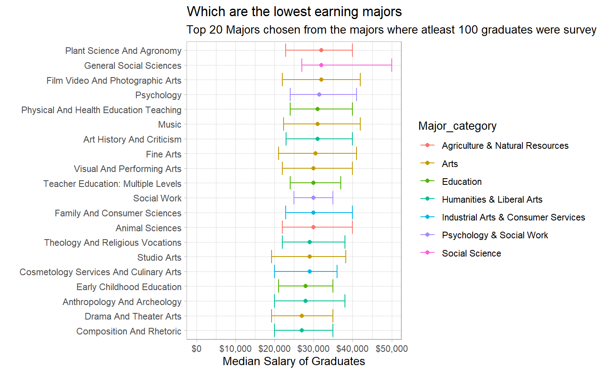<!-- -->

### Lets see if we are seeing some of the majors having high median salaries just because the sample size was too small for them. Lets’ confirm it.

``` r
recent_grads %>% 
    arrange(desc(Median)) %>% 
    select(Major, Major_category, Median, P25th, P75th, Sample_size) %>% 
    mutate(Major = str_to_title(Major),
           Major = fct_reorder(Major, Median)) %>% 
    ggplot(aes(Sample_size, Median)) +
    geom_point() +
    geom_text(aes(label = Major), check_overlap = T, vjust = 1, hjust = 1) +
    scale_x_log10()
```

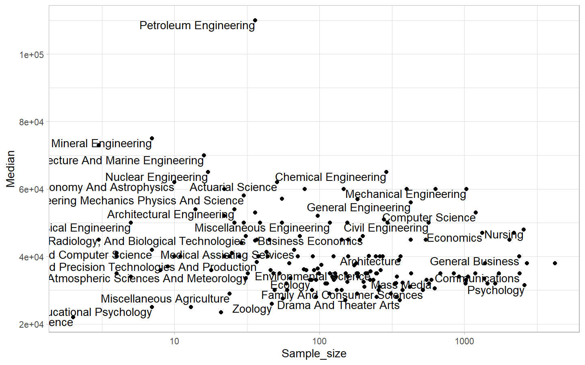<!-- -->

### What are the most common majors

``` r
recent_grads %>% 
    arrange(desc(Total)) %>% 
    head(20) %>%
    select(Major, Major_category, Total) %>% 
    mutate(Major = str_to_title(Major),
           Major = fct_reorder(Major, Total)) %>% 
    ggplot(aes(Major, Total, fill = Major_category, color = Major_category)) +
    geom_col() +
    coord_flip() +
    scale_y_continuous(labels = comma_format()) 
```

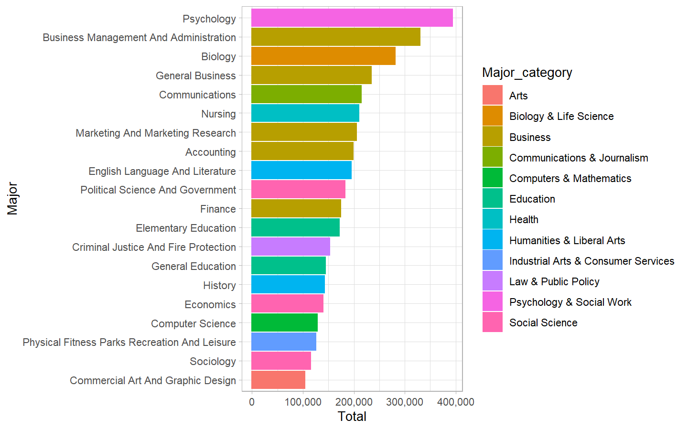<!-- -->

### What are the most common major categories

``` r
recent_grads %>% 
    count(Major_category,wt = Total, sort = T) %>% 
    mutate(Major_category = str_to_title(Major_category),
           Major_category = fct_reorder(Major_category, n)) %>% 
    ggplot(aes(Major_category, n, fill = Major_category)) +
    geom_col() +
    coord_flip() +
    theme(legend.position = "none") +
    scale_y_continuous(labels = comma_format())
```

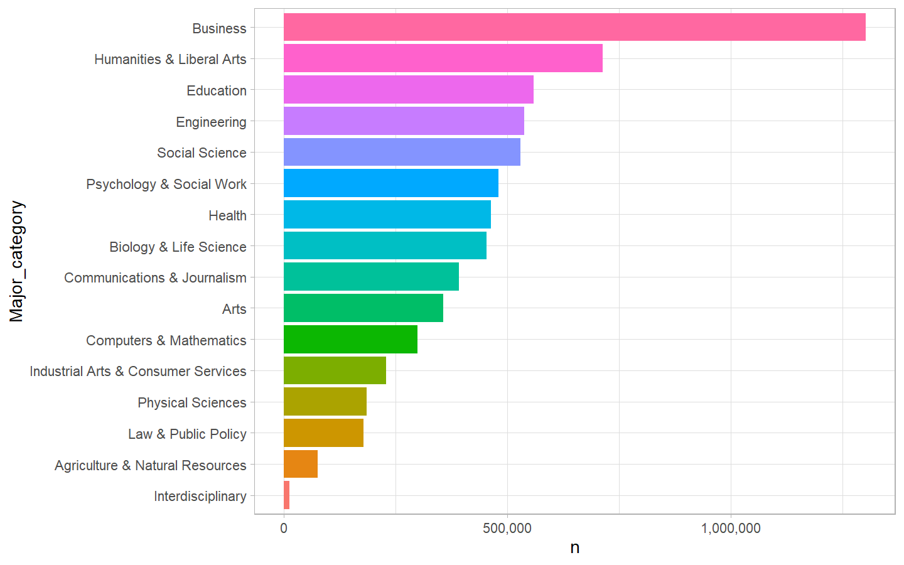<!-- -->

### How gender relates to major categories

``` r
recent_grads %>% 
    pivot_longer(Men:Women, names_to = "Gender", values_to = "Number") %>% 
    select(Major_category, Gender, Number) %>% 
    count(Major_category, Gender, wt = Number, sort = T) %>% 
    mutate(Major_category = fct_reorder(Major_category, n)) %>% 
    ggplot(aes(Major_category, n, color = Gender, fill = Gender)) +
    geom_col() +
    coord_flip() +
    scale_y_continuous(labels = comma_format()) +
    labs(x ="",
         y = "Number of Graduates")
```

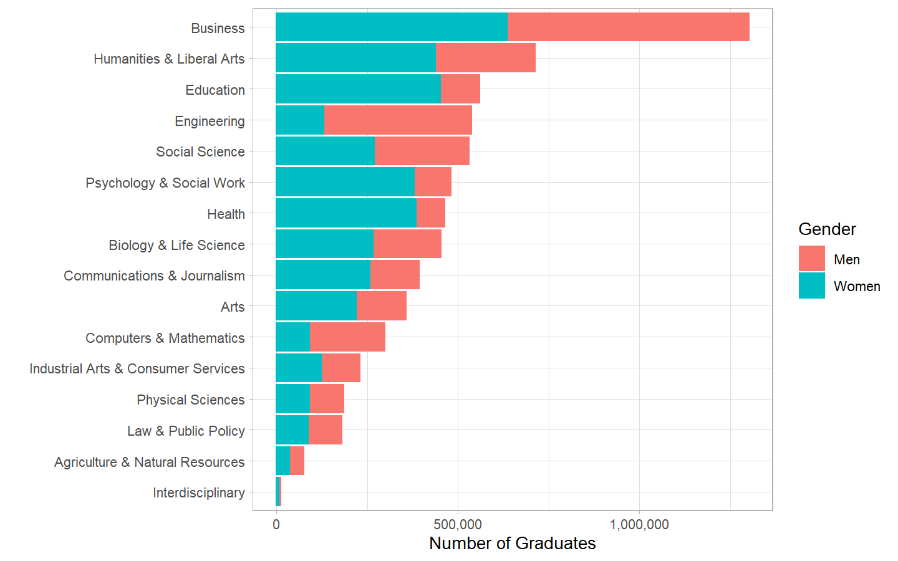<!-- -->

### How gender relates to major studies

``` r
recent_grads %>% 
    arrange(desc(Median)) %>% 
    mutate(Major = str_to_title(Major),
           Major = fct_reorder(Major, Median)) %>% 
    arrange(desc(Total)) %>% 
    head(20) %>% 
    pivot_longer(Men:Women, names_to = "Gender", values_to = "Number") %>%
    select(Major, Gender, Number) %>%
    mutate(Major = fct_reorder(Major, Number)) %>% 
    ggplot(aes(Major, Number, color = Gender, fill = Gender)) +
    geom_col(alpha = 0.7) +
    coord_flip() +
    scale_y_continuous(labels = comma_format()) +
    labs(x ="",
         y = "Number of Graduates")
```

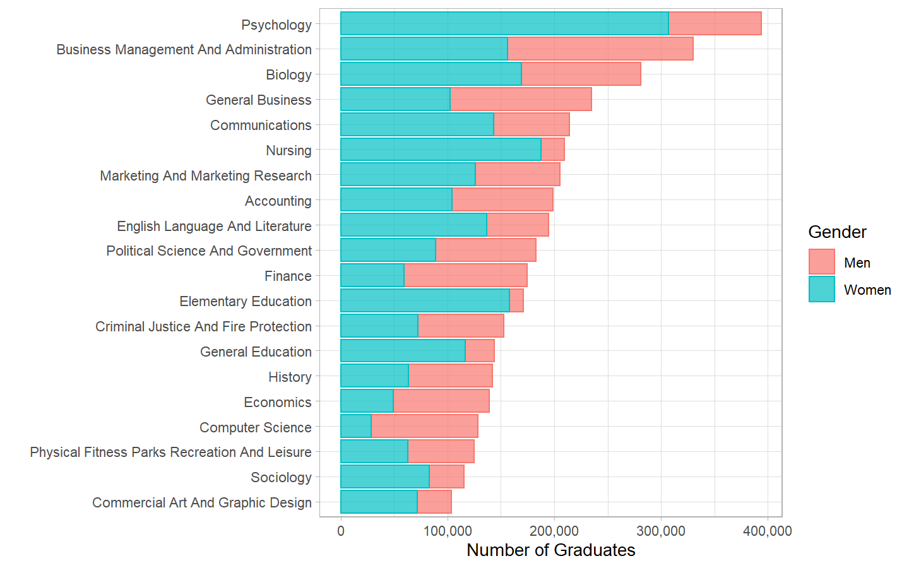<!-- -->

### Share of women is higher in majors such as Psychology, Health and Business

``` r
recent_grads %>% 
    select(Major, Major_category, ShareWomen, Total) %>% 
    drop_na() %>% 
    mutate(Major = str_to_title(Major)) %>% 
    ggplot(aes(Total, ShareWomen)) +
    geom_point(aes(color = Major), size = 2) +
    geom_text(aes(label = Major, color = Major), check_overlap = T, hjust =1, vjust = 1) +
    theme(legend.position = "none") +
    scale_x_continuous(labels = comma_format()) +
    coord_flip()
```

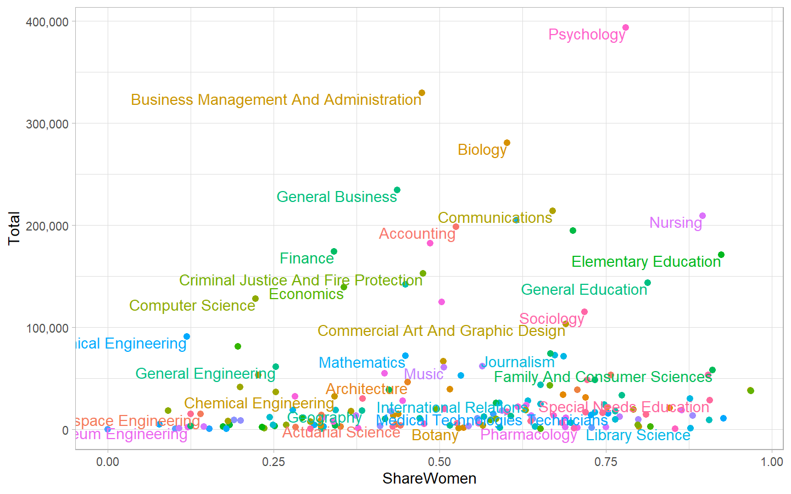<!-- -->

``` r
by_major_category <- recent_grads %>% 
    filter(!is.na(Total)) %>% 
    group_by(Major_category) %>% 
    summarise(Men = sum(Men),
              Women = sum(Women),
              Total = sum(Total),
              Median_Salary = sum(Median*Sample_size)/sum(Sample_size)) %>% 
    ungroup() %>% 
    mutate(ShareWomen = Women/Total) %>% 
    arrange(desc(ShareWomen))
```

    ## `summarise()` ungrouping output (override with `.groups` argument)

``` r
by_major_category %>% 
    ggplot(aes(ShareWomen, Median_Salary)) +
    geom_point() +
    geom_smooth(method = "lm") +
    geom_text_repel(aes(label = Major_category), hjust = 1, vjust = 1) +
    expand_limits(y = 0)
```

    ## `geom_smooth()` using formula 'y ~ x'

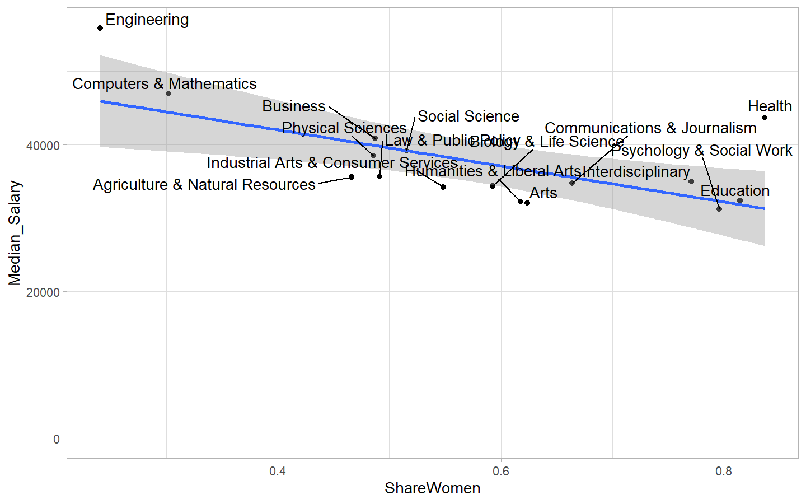<!-- -->

``` r
g <- major_processed %>% 
    ggplot(aes(ShareWomen, Median)) +
    geom_point(aes(color = Major_category, size = Sample_size, label = Major), alpha = 0.8) +
    geom_smooth(method = "lm") +
    expand_limits(y = 0) +
    scale_x_continuous(labels = percent_format()) +
    theme(legend.position = "none")
```

    ## Warning: Ignoring unknown aesthetics: label

``` r
g
```

    ## `geom_smooth()` using formula 'y ~ x'

    ## Warning: Removed 1 rows containing non-finite values (stat_smooth).

    ## Warning: Removed 1 rows containing missing values (geom_point).

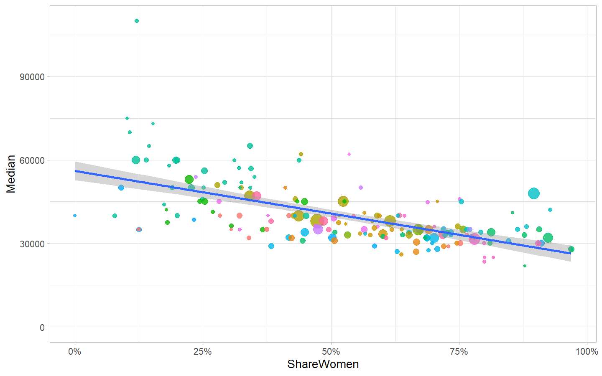<!-- -->

``` r
#ggplotly(g)
```

``` r
major_lm <- major_processed %>% 
    select(Major,Total, ShareWomen,Sample_size, Median) %>% 
    lm(Median ~ ShareWomen, data = ., weights = Sample_size) %>% 
    summary()
major_lm
```

    ## 
    ## Call:
    ## lm(formula = Median ~ ShareWomen, data = ., weights = Sample_size)
    ## 
    ## Weighted Residuals:
    ##     Min      1Q  Median      3Q     Max 
    ## -260500  -61042  -13899   33262  865081 
    ## 
    ## Coefficients:
    ##             Estimate Std. Error t value Pr(>|t|)    
    ## (Intercept)    52073       1436  36.255   <2e-16 ***
    ## ShareWomen    -23650       2403  -9.842   <2e-16 ***
    ## ---
    ## Signif. codes:  0 '***' 0.001 '**' 0.01 '*' 0.05 '.' 0.1 ' ' 1
    ## 
    ## Residual standard error: 123000 on 170 degrees of freedom
    ##   (1 observation deleted due to missingness)
    ## Multiple R-squared:  0.363,  Adjusted R-squared:  0.3592 
    ## F-statistic: 96.87 on 1 and 170 DF,  p-value: < 2.2e-16

``` r
major_lm_grouped <- major_processed %>% 
    select(Major,Major_category, Total, ShareWomen, Sample_size, Median) %>% 
    add_count(Major_category) %>% 
    filter(n>=10) %>% 
    nest(-Major_category) %>% 
    mutate(model = map(data, ~lm(Median~ShareWomen, weights = Sample_size, data = .)),
           tidied = map(model, tidy)) %>% 
    unnest(tidied) %>% 
    filter(term == "ShareWomen") %>% 
    arrange(estimate) %>% 
    mutate(fdr = p.adjust(p.value, method = "fdr"))
```

    ## Warning: All elements of `...` must be named.
    ## Did you want `data = c(Major, Total, ShareWomen, Sample_size, Median, n)`?

``` r
major_lm_grouped
```

    ## # A tibble: 9 x 9
    ##   Major_category  data   model term  estimate std.error statistic p.value    fdr
    ##   <chr>           <list> <lis> <chr>    <dbl>     <dbl>     <dbl>   <dbl>  <dbl>
    ## 1 Biology & Life~ <tibb~ <lm>  Shar~  -43735.    20982.    -2.08   0.0592 0.106 
    ## 2 Engineering     <tibb~ <lm>  Shar~  -33912.    15418.    -2.20   0.0366 0.0937
    ## 3 Computers & Ma~ <tibb~ <lm>  Shar~  -28694.    18552.    -1.55   0.156  0.235 
    ## 4 Business        <tibb~ <lm>  Shar~  -28171.     9810.    -2.87   0.0152 0.0937
    ## 5 Agriculture & ~ <tibb~ <lm>  Shar~  -16263.     5975.    -2.72   0.0297 0.0937
    ## 6 Physical Scien~ <tibb~ <lm>  Shar~  -12820.    13349.    -0.960  0.365  0.469 
    ## 7 Education       <tibb~ <lm>  Shar~   -1996.     3084.    -0.647  0.528  0.594 
    ## 8 Humanities & L~ <tibb~ <lm>  Shar~   -1814.     4128.    -0.439  0.668  0.668 
    ## 9 Health          <tibb~ <lm>  Shar~   54721.    23427.     2.34   0.0416 0.0937

### End of Report
